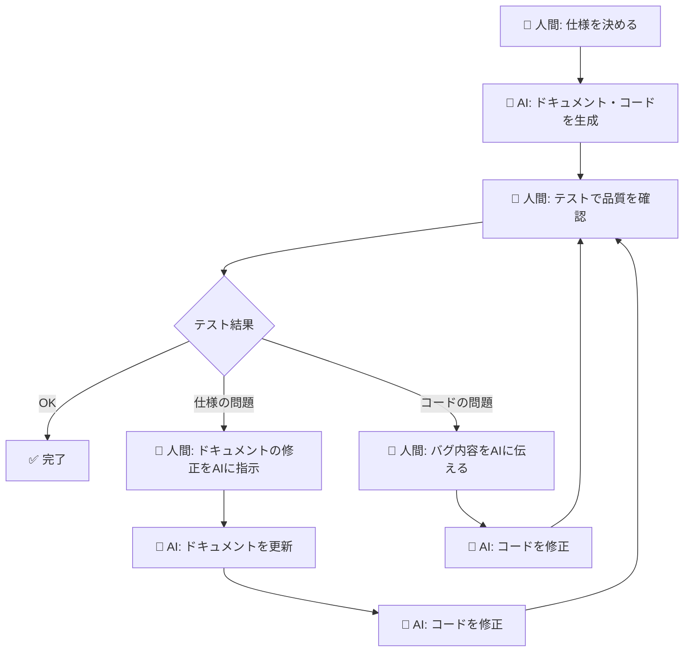

# はじめに

以前、[Claude Codeスキルで実現する仕様駆動開発](https://zenn.dev/sakamotchi/articles/ai-spec-driven-development)という記事で、AIの暴走を防ぎつつ一貫性のある開発を実現する手法を紹介しました。

今回、この手法を**既存プロダクトに導入するためのスターターキット**を公開しました。

https://github.com/sakamotchi/spec-driven-starter

# 仕様駆動開発の基本思想

このスターターキットが前提とする役割分担は以下の通りです。

- **人間の役割**: 仕様の決定、レビュー、テストによる品質担保
- **AIの役割**: 仕様に基づくコードの実装、ドキュメントの生成・更新

**人間がコードを直接書くのではなく、仕様（ドキュメント）を通じてAIに意図を正確に伝え、その出力をテストで検証する**のが基本の開発サイクルです。



テストでバグを見つけた場合も、人間が直接コードを修正するのではなく、AIに修正を指示します。バグの原因が仕様にあればドキュメントの修正から、コードにあればバグ内容を伝えてAIに修正させます。

# スターターキットの内容

## 2つのClaude Codeスキル

### generate-steering-docs — 永続化ドキュメント生成スキル

プロダクトの「信頼できる情報源（Single Source of Truth）」となる6種の永続化ドキュメントを生成するスキルです。

| ドキュメント | 内容 |
|------------|------|
| `01_product_requirements.md` | プロダクト要求定義書 |
| `02_functional_design.md` | 機能設計書 |
| `03_architecture_specifications.md` | 技術仕様書 |
| `04_repository_structure.md` | リポジトリ構造定義書 |
| `05_development_guidelines.md` | 開発ガイドライン |
| `06_ubiquitous_language.md` | ユビキタス言語定義書 |

このスキルの特徴は、**プロダクトのコードを自動解析**する点です。package.json や Cargo.toml などの依存定義ファイル、ディレクトリ構造、lint設定などを読み取り、技術スタックやプロジェクト構成を自動で把握します。ユーザーへのヒアリングは、コードから判断できない「目的」「要件」「用語」などに絞っています。

さらに、永続化ドキュメントの生成後、その内容をもとに次のスキル（generate-working-docs）のテンプレートも**プロダクト用に自動カスタマイズ**します。

### generate-working-docs — 開発作業ドキュメント生成スキル

個別の開発作業ごとに、以下の4つのドキュメントを自動生成するスキルです。

```
docs/working/{YYYYMMDD}_{要件名}/
├── requirements.md      # 要件定義書
├── design.md           # 設計書
├── tasklist.md         # タスクリスト
└── testing.md          # テスト手順書
```

テンプレートは導入時にプロダクト用にカスタマイズされているため、技術スタックに合ったセクション構成で生成されます。例えば、REST APIを使うプロダクトならdesign.mdに「API設計」セクションが、Playwrightを使っているならtesting.mdに「E2Eテスト」セクションが含まれます。

## CLAUDE.mdスニペット

CLAUDE.mdに貼り付けるだけで、ドキュメント管理ルールが機能するスニペット集です。

- 永続化ドキュメントの一覧と更新タイミング
- 開発作業ドキュメントのディレクトリ構造とルール
- コード変更時のドキュメント更新ルール

# 導入手順

## Step 1: スキルのコピー

リポジトリをクローンし、スキルを自分のプロダクトにコピーします。

```bash
git clone https://github.com/sakamotchi/spec-driven-starter.git /tmp/spec-driven-starter

cp -r /tmp/spec-driven-starter/skills/generate-steering-docs /path/to/my-project/.claude/skills/
cp -r /tmp/spec-driven-starter/skills/generate-working-docs /path/to/my-project/.claude/skills/
```

## Step 2: 永続化ドキュメントの生成

Claude Codeを起動して「永続化ドキュメントを作成して」と依頼するだけです。

```
User: 永続化ドキュメントを作成して
Claude: プロダクトについていくつか質問させてください。
        1. プロダクト名は？
        2. どんなプロダクトですか？
        ...
Claude: 以下のドキュメントを生成しました：
        ✅ docs/steering/01_product_requirements.md
        ✅ docs/steering/02_functional_design.md
        ✅ docs/steering/03_architecture_specifications.md
        ✅ docs/steering/04_repository_structure.md
        ✅ docs/steering/05_development_guidelines.md
        ✅ docs/steering/06_ubiquitous_language.md

        開発作業ドキュメントのテンプレートもカスタマイズしました：
        ✅ design.md - 「API設計（REST）」「DB設計」セクションを追加
        ✅ testing.md - 「ユニットテスト（Jest）」セクションを追加
```

## Step 3: CLAUDE.mdの更新

```
User: claude-md-snippets の内容を CLAUDE.md に追記して
```

## Step 4: 運用開始

```
User: ログイン機能の開発ドキュメントを作成して
Claude: ✅ docs/working/20260321_login-feature/ を作成
        ✅ requirements.md / design.md / tasklist.md / testing.md を生成
```

# 運用のポイント

## ドキュメントの更新はAIに依頼する

仕様駆動開発では、ドキュメントの更新もAIに依頼するのが基本です。

```
User: 今の変更に合わせて永続化ドキュメントを更新して
Claude: ✅ docs/steering/03_architecture_specifications.md - 新規APIを追加
        ✅ docs/steering/06_ubiquitous_language.md - 新しい用語を追加
```

テンプレートやスキル定義自体の改善も自然言語で依頼できます。

```
User: テストフレームワークをJestからVitestに移行したので、
      testing.mdのテンプレートを更新して
```

## テストでバグを見つけたらAIに修正を依頼する

testing.mdの手順に従って人間がテストし、バグを見つけたらその内容をAIに伝えます。

- **仕様の問題**: まずドキュメントの修正を依頼 → コード修正を依頼
- **コードの問題**: バグの症状を伝えてコード修正を依頼

人間は「何が問題か」を判断し、「どう直すか」はAIに委ねます。

## テストは人間が操作して確認することを最優先にする

AIが書いたコードをAIがテストしても、仕様の誤解や認識のズレを検出しにくいです。testing.mdでは手動操作による確認を最優先とし、自動テストは手動で確認が困難な項目に限定しています。

## ドキュメントは最初から完璧にしない

永続化ドキュメントは初回生成時にすべてを網羅する必要はありません。開発を進めながら「ここも追記して」と依頼して段階的に充実させるのが現実的です。

# 前回の記事との違い

[前回の記事](https://zenn.dev/sakamotchi/articles/ai-spec-driven-development)では、仕様駆動開発の考え方と実践方法を紹介しました。今回のスターターキットは、その手法を**すぐに導入できるパッケージ**として整備したものです。

| 前回の記事 | 今回のスターターキット |
|-----------|---------------------|
| 手法の紹介・解説 | 導入用のスキルとテンプレート一式 |
| sql-query-build固有の実装例 | 技術スタックに依存しない汎用設計 |
| 永続化ドキュメントは手動作成 | コード自動解析+ヒアリングで初期生成 |
| テンプレートはプロダクト固有 | 導入時にプロダクト用に自動カスタマイズ |

# おわりに

仕様駆動開発は、AIコーディングエージェントと協力するための「お作法」のようなものです。ドキュメントを整備し、AIにガードレールを提供することで、安定した品質の開発が可能になります。

正直なところ、このスターターキットの導入実績はまだ[sql-query-build](https://github.com/sakamotchi/sql-query-build)での実践が中心で、他のプロダクトでの検証はこれからです。技術スタックやプロダクトの規模によって、テンプレートの過不足やスキルの改善点が出てくると思います。

だからこそ、実際に試していただいた方からのフィードバックが非常にありがたいです。「このセクションは不要だった」「こういうテンプレートが欲しい」といった声をいただければ、改善に反映していきます。

https://github.com/sakamotchi/spec-driven-starter

フィードバックや改善提案は、リポジトリのIssueでお待ちしています。
