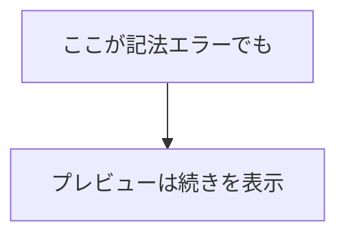

# はじめに

Claude CodeなどのAIコーディングエージェントを使っていると、Markdownファイルが高頻度で書き換えられるシーンが増えました。

このとき問題になるのが、Markdownプレビューの安定性です。ファイルの更新が連続すると、プレビューが応答しなくなったり、クラッシュに近い状態になることがあります。

そこで、AIエージェントによる高頻度更新に対して堅牢なMarkdownプレビュー拡張「**AI Safe Markdown Preview**」を作りました。

https://github.com/sakamotchi/vscode-robust-markdown

# 問題：AI更新に弱いプレビューツールがある

AIコーディングエージェントがMarkdownファイルを編集するとき、1秒以内に複数回の書き込みが走ることがあります。

VSCodeの標準Markdownプレビューは通常の編集を想定しているため、このような連続更新に対して：

- プレビューが点滅・ちらつく
- レンダリングが途中で止まる
- まれにパネル全体が応答しなくなる

といった問題が起きやすくなります。

また、Mermaidダイアグラムを含むMarkdownファイルをプレビューしたい場合、標準プレビューでは追加の設定が必要で、記法ミスがあるとプレビュー全体に影響することもあります。

# 解決策：1000msデバウンスとエラー分離

AI Safe Markdown Previewは、以下の設計でこれらの問題を解消します。

## 1. 1000msデバウンスによる更新抑制

ファイル変更イベントを受け取っても、すぐにはレンダリングしません。最後の変更から1000ms経過したタイミングで初めてプレビューを更新します。

```
ファイル変更 → ファイル変更 → ファイル変更 → 1000ms待機 → レンダリング
```

AIエージェントが短時間に何度書き込んでも、レンダリングは1回だけ走ります。これにより、プレビューの安定性が大幅に向上します。

## 2. Mermaidエラーの分離

Mermaidブロックに記法ミスがあった場合、そのブロックだけエラー表示になり、**プレビュー全体はクラッシュしません**。



エラーはダイアグラムの表示域にインラインで表示されるため、どこに問題があるかもすぐわかります。

## 3. Markdownパースエラーの無害化

Markdownのパース自体でエラーが発生した場合も、例外をキャッチしてエラーメッセージをHTML内に表示します。プレビューパネルは維持されます。

# 機能一覧

| 機能 | 詳細 |
|------|------|
| Markdownプレビュー | markedライブラリによるHTML変換 |
| AI更新耐性 | 1000msデバウンスで連続更新をまとめる |
| Mermaidサポート | SVGレンダリング、エラー分離、オフライン対応 |
| テーマ切り替え | ライト/ダーク、VSCodeテーマと自動同期 |
| 複数ファイル対応 | ファイルごとに独立したタブで管理 |
| 起動方法 | エディタタブアイコン または 右クリックメニュー |

# 使い方

## インストール

VS Code Marketplaceから直接インストールできます。

https://marketplace.visualstudio.com/items?itemName=sakamoto-yoshitaka.vscode-robust-markdown

または、VSCode内の拡張機能検索で「AI Safe Markdown Preview」と検索してインストールしてください。

## プレビューを開く

Markdownファイルを開いた状態で、以下のいずれかの方法でプレビューを起動します。

- エディタタブ右端のプレビューアイコンをクリック
- エディタ上で右クリック → 「Open Robust Markdown Preview」

プレビューはエディタの横に開き、ファイルの編集・保存に合わせて自動更新されます。

## テーマ切り替え

プレビュー上部の「☀ ライト」または「☾ ダーク」ボタンでテーマを切り替えられます。初期テーマはVSCodeの現在のテーマに合わせて自動設定されます。

# 内部実装

## アーキテクチャ

```
extension.ts          # activate/deactivate、コマンド登録、イベント購読
    ↓
PreviewManager        # WebviewPanelのライフサイクル管理
    ↓
markdownRenderer.ts   # Markdown → HTML変換（marked + Mermaid前処理）
    ↓
webview/template.ts   # WebviewのHTMLテンプレート生成
```

## デバウンスの実装

デバウンス処理はシンプルな汎用関数として実装しています。

```typescript
export function debounce<T extends (...args: unknown[]) => void>(
    fn: T,
    delay: number
): (...args: Parameters<T>) => void {
    let timer: ReturnType<typeof setTimeout> | undefined;
    return (...args: Parameters<T>) => {
        if (timer !== undefined) {
            clearTimeout(timer);
        }
        timer = setTimeout(() => fn(...args), delay);
    };
}
```

PreviewManagerは各ファイルURIをキーとしてデバウンスタイマーを管理しており、複数ファイルのプレビューを同時に開いていても互いに影響しません。

## MermaidのCSP対応

VSCodeのWebviewはContent Security Policy（CSP）が厳しく、外部スクリプトの読み込みは制限されています。mermaid.jsはビルド時にdistディレクトリにコピーし、`webview.asWebviewUri()` でローカルリソースとして読み込む設計にしています。

```typescript
// CopyWebpackPluginでmermaid.min.jsをdistにコピー
new CopyWebpackPlugin({
    patterns: [
        {
            from: 'node_modules/mermaid/dist/mermaid.min.js',
            to: 'mermaid.min.js',
        },
    ],
})
```

これによりオフライン環境でもMermaidが動作します。

# 現在の制限

- デバウンス時間（1000ms）はユーザーが変更できない
- プレビューを閉じるとテーマの設定がリセットされる

いずれも今後のバージョンで対応予定です。

# まとめ

AIコーディングエージェントとMarkdownを組み合わせる機会が増えるにつれ、プレビューツールへの要求も変わってきました。

AI Safe Markdown Previewは、その変化に対応するために作った拡張です。「AIが書き換えても壊れないプレビュー」という1点に絞ってシンプルに設計しました。

Claude CodeなどのAIエージェントとMarkdownを使う機会が多い方は、ぜひ試してみてください。
